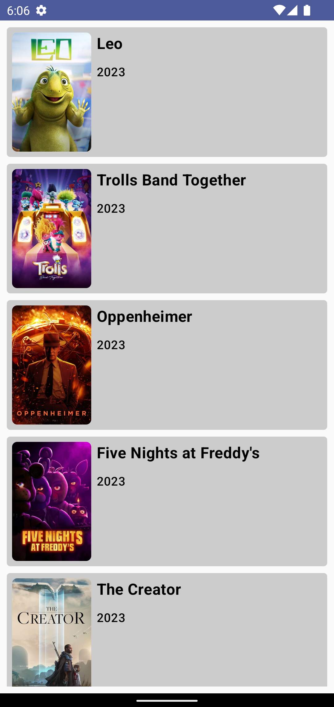
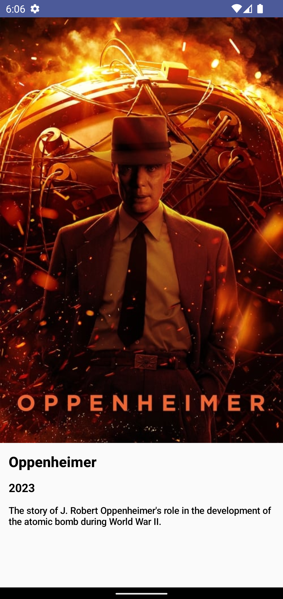

# Movie App
Android Movie app using [TMDB Movies Api](https://developer.themoviedb.org/reference/intro/getting-started).

## Tech Stack
- Gradle 8.4 and AGP 8.2:
- [Version Catalog](https://docs.gradle.org/current/userguide/platforms.html#sub:version-catalog).
- 100% Kotlin:
    - Jetpack Compose.
    - DSL.
    - Coroutines.
- Architecture: Clean Arch + MVI.
- Dagger Hilt for dependency injection.
- Jetpack arch Components.
- Ktor for networking.
- Paging 3.
- Debugging Tools:
    - [Timber](https://github.com/JakeWharton/timber) for logging.
    - Logging interceptor to log API requests.
- Unit Testing:
    - [Junit5](https://junit.org/junit5/docs/current/user-guide).
    - [Mockk](https://github.com/mockk/mockk).
    - [Kluent](https://github.com/MarkusAmshove/Kluent).
    - [Turbine](https://github.com/cashapp/turbine).
- Static analysis tools:
    - [Detekt](https://github.com/detekt/detekt).
- Other Libs and tools:
    - [Coil](https://github.com/coil-kt/coil) for image loading.
- CI/CD: [Github Actions](.github/workflows)

## Screenshots

